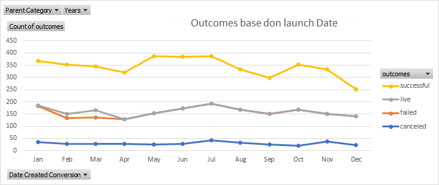
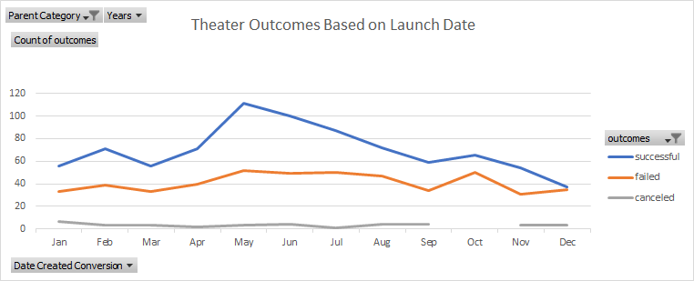
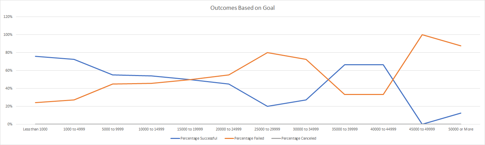

# Kickstarter-analysis
Performing analysis on Kickstarter data to uncover trends

# Kickstarting with Excel
## Overview of the Project

This project reviewed the kickstarter campaign utilizing advanced functions in excel

###
The purpose of the analysis was to identify how different campaigns did in relation to their launch dates and funding goals.
The analysis can be found here
[Kickstarter_Challenge - Copy](Kickstarter_Challenge - Copy.xlxs)

## Analysis and Challenges

## Analysis of Outcomes Based on Launch Date
To perform this analysis, the kickstarter campaign was first filtered by year. The data was then created into a pivot table and filtered based on the parent category of theater. The data was sorted based on date created conversion-by month. It was also sorted by only the successful, failed, and cancelled outcomes. 
The results of the theater outcomes based on launch date can be found here

## Analysis of Outcomes Based on Goals
To perform this analysis, a table was first created to identify goal ranges. Then, only using the plays subcategory, a total number of successful, failed and cancelled plays were calculated for each of the goal categories. In addition, a sum of the total number of projects were included for each goal category. Finally, the percentage of successful, failed and cancelled were calculated for each of the goal categories base don the total projects in that goal category. 

The results of the outcomes based on goals can be found here

###
Challenges and difficulties Encountered

I did not have any challenges or difficulties obtaining this data. Some possible challenges that can occur, is filtering based on the wrong parent category or subcategory, or incorrectly entering the formula for the goal categories therefore, not having accurate numbers of successful, failed or canceled items.

## 
Results

- Two conclusion I can draw about the theater outcomes by launch date are
	* The most successful Theater outcomes occurred in May/June before tapering off by the end of the year
	* The failed theater outcomes never exceeded the number of successful outcomes
  * The higher the goal for a campaign, the more likely it was to fail. Goals with the lower goal were the most successful

* Some limitations to this data set is that we have different countries and currencies being used. We cannot compare those in the US dollars equally with those in pounds, as the exchange rate between two countries are not always 1:1. The goals and pledges are based across various countries and therefore, should only be compared to the country they are in

* Other possible tables and/or graphs that we could create are
  *   Identify which country had the most campaign based on category and subcategory
	*  Calculate the time between the date created and the date ended to know how long each campaign ran.

